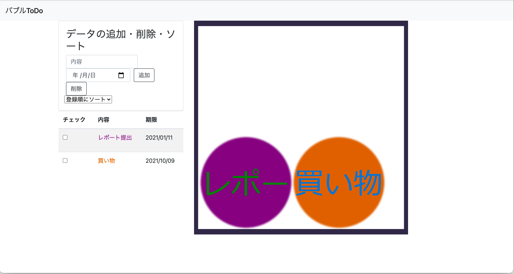

# BubbleToDo
バブルUI付きToDoリスト

# 内部ディレクトリ構造
<pre>
Repository/
  ├ img/
  |   └ ---.png
  ├ static/
  |   ├ bubble.js
  |   ├ bubbletodo.css
  |   └ main.js
  ├ templates/
  |   └ index.html
  ├ app.py
  ├ create_bubble_img.py
  └ todo-list.json
</pre>

|  ファイル  |  内容  |
| ---- | ---- |
|  bubbletodo.css  |  index.htmlに適用するCSS  |
|  main.js  |  index.html内のフォームの動作を定義するJavaScriptプログラム  |
|  bubble.js  |  htmlに物理演算のバブルを表示させるJavascriptプログラム  |
|  index.html  |  ToDoリストおよびバブルUIを表示するHTML  |
|  app.py  |  Flaskルーティングとjsonファイルに対する操作を行うPythonプログラム  |
|  create_bubble_img.py  |  bubble.jsで使うテクスチャに適用させる画像を作成するPythonプログラム  |
|  todo-list.json  |  ToDoリストのデータが保存されているJSONファイル  |

## todo-list.jsonの内容例

<pre>
[
    {
        "id": 1,
        "content": "内容",
        "timelimit": "2020/12/10",
        "size": 200,
        "color": "#ff0000"
    }
]
</pre>

|  キー  |  値  |
| ---- | ---- |
|  id  |  データ識別用ID.削除時に使用.整数型.  |
|  content  |  ToDoリストの内容.文字列型.  |
|  timelimit  |  ToDoの期限.文字列型.  |
|  size  |  バブル用画像の大きさ.画像作成時に設定し、bubble.jsの当たり判定設定の際に使用する.  |
|  color  |  ToDoとバブルを対応づけるための色.文字列型でカラーコードが保存される.  |

# バージョン

- Python:3.5.8
- Flask:1.1.2
- Pillow:8.0.1
- Jinja2:2.11.2
- jQuery:1.9.1
- Matter.js:0.14.2

# 実行方法

## 事前準備

- Pillowのインストール

以下のコマンドを実行
<pre>$ pip install Pillow</pre>

- Flaskのインストール

以下のコマンドを実行
<pre>$ pip install flask</pre>

## 実行手順

1. Repositoryのディレクトリに移動し、以下のコマンドを実行
<pre>$ python3 app.py</pre>

2. ブラウザにて、127.0.0.1:5000またはlocalhost:5000にアクセス

# 担当者

|  内容  |  担当者  |
| ---- | ---- |
|  バブルUI  |  EveSquare  |
|  データの追加  |  LongMine  |
|  データの削除  |  k19051  |
|  データのソート  |  KawaiKohsuke  |
